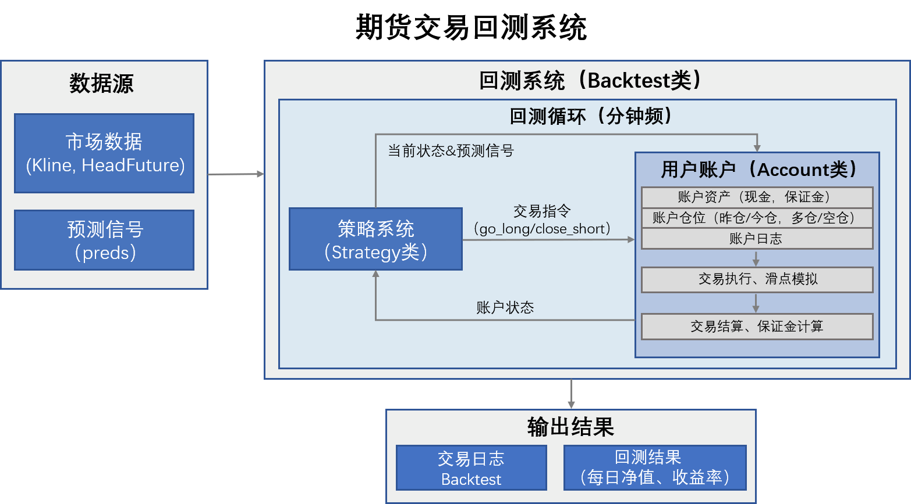

# IC_min_CTA
> **项目名称：基于集成学习的 IC 期货高频因子挖掘与量化交易系统**
> **开发者：Xiaoxin Wei**

本项目构建了一个从底层行情处理到终端结果分析的闭环量化研究框架。核心逻辑围绕中证500指数期货（IC）展开，利用机器学习算法捕捉分钟级别的非线性 Alpha 收益。

---

## 1. 项目全景架构 (Pipeline Architecture)

本系统由五个核心阶段组成，各阶段通过数据流紧密耦合。


### 📂 核心文件索引
* **第 1 步：因子生成** - `1.cal_factors.py`：利用并行计算引擎生成 Alpha 因子库。
* **第 步：统计校验** - `2.factor_performance.py`：评估因子预测能力的显著性。
* **第 3 步：机器学习建模** -  `3.price_pred.ipynb` &`3.1.tune_params_xgb.ipynb`&`3.1.tune_params_lgbm.ipynb`：参数超优搜索与价格收益率预测。
* **第 4 步：仿真回测** - `4.backtest.ipynb`：考虑保证金与反手逻辑的高仿真交易系统。
* **第 5 步：深度分析** - `5.1.account_log_analysis.ipynb` & `5.2.result_analyze.ipynb`：日志挖掘与绩效评估。

---

## 2. 核心数学模型与算法 (Mathematical Models)

在本项目中，我们定义并实现了以下量化评估指标：

### 2.1 因子有效性指标 (Factor Metrics)
因子与未来 $N$ 期收益率 $R_{t+N}$ 的相关性是筛选特征的核心。

* **信息系数 (Information Coefficient, IC):**
    $$IC_t = \text{corr}(F_t, R_{t+N})$$
* **信息比率 (Information Ratio, IR):**
    $$IR = \frac{E[IC_t]}{\sigma(IC_t)}$$
* **加权信息系数 (Weighted IC):**
    $$WIC = \frac{\sum w_i \cdot (f_{i} - \bar{f})(r_{i} - \bar{r})}{\sqrt{\sum w_i(f_{i} - \bar{f})^2 \sum w_i(r_{i} - \bar{r})^2}}$$
    *(其中 $w_i$ 为基于波动率或成交量的权重)*

### 2.2 机器学习损失函数
模型训练（XGBoost/LGBM）旨在最小化均方误差（MSE）：
$$L(\theta) = \sum_{i=1}^{n} (y_i - \hat{y}_i)^2 + \Omega(f)$$
其中 $\Omega(f)$ 为正则化项，用于防止在高维特征空间过拟合。

---

## 3. 策略实现细节 (Implementation Details)

### 3.1 因子挖掘体系 (`1.cal_factors.py`)
利用 `pyTSL` 读取 `.tdf` 原始行情数据。本项目实现了多种风格的 Alpha 因子，如：
- **Alpha001**: `Correlation(Rank(Delta(log(Volume), 2)), Rank((Close - Open) / Open))`
- **Alpha026**: 基于价量差分的动量因子。

### 3.2 高仿真回测系统 (`4.backtest.ipynb`)
不同于简单的向量化回测，本项目实现了基于 `Account` 类的账户管理系统：
1.  **保证金管理**：支持 IC 合约 200 倍乘数及动态保证金率计算。
2.  **仓位限制 (Limits)**：
    $$Limit_{new} = \lfloor \frac{Cash \times Leverage}{Price \times Multiplier \times SecuRate} \rfloor$$
3.  **交易逻辑**：内置全多反手、日末锁仓（End-lock）等贴近实盘的控制逻辑。

---

## 4. 绩效表现与可视化 (`5.2.result_analyze.ipynb`)

分析模块提供以下关键指标输出：

| 指标类型 | 详细参数 | 公式描述 |
| :--- | :--- | :--- |
| **收益性** | 年化收益 (Annual Return) | $R_{ann} = (1 + R_{total})^{\frac{252}{N}} - 1$ |
| **稳定性** | 夏普比率 (Sharpe Ratio) | $S = \frac{E[R_p - R_f]}{\sigma_p}$ |
| **风险控制** | 最大回撤 (Max Drawdown) | $MDD = \max \left( \frac{P_{peak} - P_{t}}{P_{peak}} \right)$ |

---

## 5. 环境配置与使用指南

### 🔧 依赖环境
```bash
# 推荐使用 Python 3.8+
pip install numpy pandas xgboost lightgbm matplotlib seaborn scipy tqdm openpyxl
```

## 🏃 运行流程 (Execution Pipeline)

按照以下步骤执行脚本，即可完成从数据预处理到策略评估的全流程：

1.  **初始化配置 (Initialization)** 进入 `Config/` 文件夹，根据你的本地路径修改 `factor_config.py` 和 `model_config.py`。确保 `Database/` 目录下包含主力合约映射表 `IC_head_future.xlsx`。

2.  **因子准备 (Factor Engineering)** 在终端运行以下命令，系统将通过并行计算生成特征矩阵并保存至 `Factors/` 目录：
    ```bash
    python 1.cal_factors.py
    ```

3.  **模型优化 (Hyperparameter Tuning)** 依次运行以下 Jupyter Notebook，通过网格搜索或随机搜索确定最优超参数组合：
    - `3.1.tune_params_lgbm.ipynb`
    - `3.1.tune_params_xgb.ipynb`

4.  **生成预测 (Signal Generation)** 打开 `3.price_pred.ipynb`，加载最优参数并对测试集进行收益率预测，系统将输出信号文件：
    - 输出路径：`Results/xgb_10min.pkl`（以 10 分钟预测为例）。

5.  **查看分析 (Backtesting & Analysis)** - **执行回测**：运行 `4.backtest.ipynb` 模拟交易过程，生成 `account.log`。
    - **绩效评估**：通过 `5.2.result_analyze.ipynb` 自动化生成净值曲线、夏普比率及最大回撤报告。